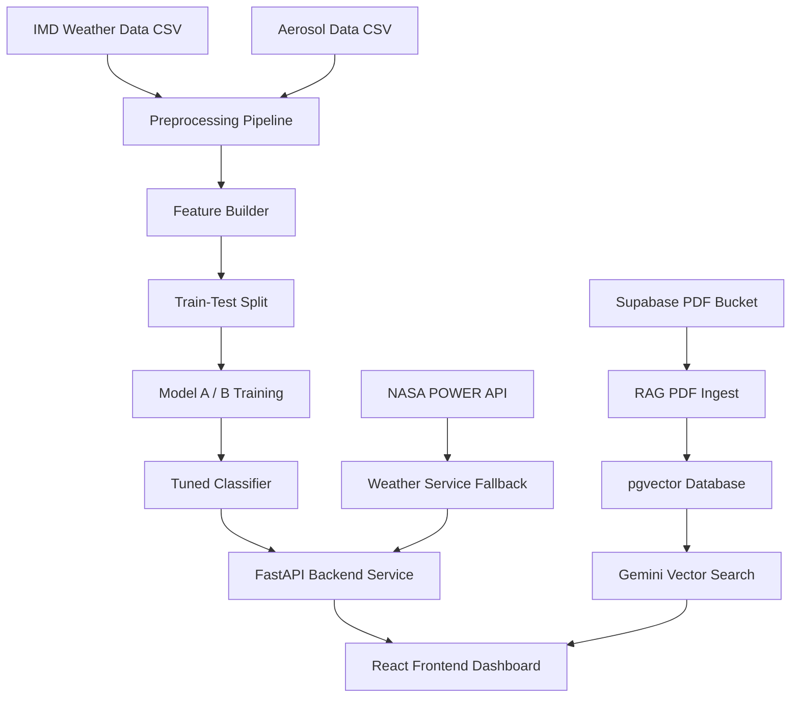

# Heatwave Early Warning System (HEWS): System Architecture, ML Pipeline, and Generative RAG Advisories

This document provides a comprehensive technical overview of the **Heatwave Early Warning System (HEWS)**. HEWS is an end-to-end research-grade application designed to forecast heatwave severity classes (Normal, Moderate, Severe) at a district level in Karnataka, India, and generate context-aware, demographic-specific public safety advisories.

---

## 1. Executive Summary & Research Context

Traditional heatwave early warning systems often suffer from several limitations:
1. **Generic Regional Thresholds:** Relying on simple regional maximum temperature thresholds (e.g., standard 40°C limits) ignores micro-level geographical parameters like elevation, coastal influences, and hilly terrain.
2. **Disregard for Aerosols:** Standard systems omit atmospheric aerosols (measured by Aerosol Optical Depth, PM2.5, and PM10), which can couple with heat to worsen thermal distress and respiratory vulnerability.
3. **Severe Class Imbalance:** True heatwaves represent less than **3% of historical observations** (~2.74%). Standard classifiers default to high false negatives (failing to predict extreme events).
4. **Generic Public Advisories:** Public advisories are typically static and generic, rather than tailored to vulnerable groups like farmers, outdoor travelers, and the general public.

**HEWS solves these challenges by:**
* Integrating **India Meteorological Department (IMD)** weather records with aerosol indicators.
* Developing a leakage-safe, class-weighted **Random Forest Classifier** optimized through nested cross-validation (Moderate threshold = 0.20, Severe threshold = 0.16) to maximize recall for extreme events.
* Constructing a **Retrieval-Augmented Generation (RAG)** pipeline using **LangChain, pgvector, and Google Gemini** to retrieve localized warning protocols and synthesize custom, persona-based advisories.
* Providing a responsive **React/Vite & Tailwind CSS** dashboard featuring interactive geo-maps and charts.

---

## 2. System Architecture & Component Interaction

The flow of data and interaction between components in HEWS is visualized below:



The system operates across three tiers:
1. **Data & ML Tier:** Combines multi-source inputs, engineers rolling/lag features, and trains classifiers.
2. **Backend API Tier (FastAPI):** Exposes async endpoints for forecasting, alerts, research access, and role-based views. Preloads the ML pipeline on startup for sub-second inference.
3. **Frontend Tier (React + Vite):** Offers interactive geospatial mapping via Leaflet and dynamic temporal charts via Recharts.

---

## 3. Database Schema & Entities

The relational database is built on **PostgreSQL 15+** with the **pgvector** extension. **SQLAlchemy 2.0** manages asynchronous database transactions via `AsyncSession` and `asyncpg`. Migrations are tracked with **Alembic**.

### Database Entity-Relationship Summary

* **`District`:** Stores regional geography and metadata.
  * Fields: `id`, `name`, `state`, `latitude`, `longitude`, `population`, `elevation`, `is_coastal` (bool), `is_hilly` (bool).
* **`IMDWeatherData`:** Stores historical and current raw physical parameters.
  * Fields: `district_id`, `date`, `max_temp`, `min_temp`, `mean_temp`, `humidity`, `wind_speed`, `pressure`, `solar_radiation`, `rainfall`.
* **`AerosolData`:** Tracks atmospheric particulates.
  * Fields: `district_id`, `date`, `aod_value`, `pm25`, `pm10`.
* **`HeatwavePrediction`:** Stores model inferences.
  * Fields: `id`, `district_id`, `prediction_date`, `forecast_date`, `risk_level` (Enum: `LOW`, `MODERATE`, `HIGH`, `EXTREME`), `risk_score` (float probability), `confidence`, `model_version`, `shap_values` (JSON).
* **`ModelRegistry`:** Version control for ML estimators.
  * Fields: `model_name`, `version`, `algorithm`, `accuracy`, `model_path`, `is_active`.
* **`Advisory`:** Stores generated RAG demographic recommendations.
  * Fields: `id`, `prediction_id`, `role` (Enum: `PUBLIC`, `FARMER`, `TRAVELLER`, `AUTHORITY`), `title`, `content`, `document_source`.
* **`Alert`:** Elevated alarms mapping safety thresholds.
  * Fields: `id`, `district_id`, `risk_level`, `message`, `status` (Enum: `ACTIVE`, `RESOLVED`), `created_at`.
* **`SystemLog`:** Audit logs tracking operations for compliance and latency research.
  * Fields: `id`, `user_id`, `action`, `details` (JSON string), `ip_address`, `timestamp`.
* **RAG Tables (`Document`, `DocumentChunk`, `Embedding`):** Stores split reference text segments and their corresponding vector embeddings (3072 dimensions) generated by Google Gemini.

---

## 4. Machine Learning Forecasting Pipeline (`ml/`)

The machine learning module is built in Python using **scikit-learn**, **joblib**, and **SHAP** for interpretability.

### 4.1 Data Cleaning & Preprocessing
* **Range Filtering:** Restricts raw input to valid physical ranges (e.g., maximum daily temperature bounded between $0^\circ\text{C}$ and $60^\circ\text{C}$).
* **Imputation:** Aerosol values (AOD, PM2.5, PM10) are imputed using linear interpolation, capped at 3 consecutive missing days to maintain temporal integrity.
* **Winsorization:** Outliers are capped based on the Interquartile Range (IQR) method:
  $$\text{Lower Bound} = Q_1 - 3 \times \text{IQR}, \quad \text{Upper Bound} = Q_3 + 3 \times \text{IQR}$$

### 4.2 Feature Engineering
HEWS expands base parameters into a rich multi-dimensional feature space:
1. **Apparent Heat Index (HI):** Calculated using the NOAA Rothfusz regression equation:
   $$HI = -42.379 + 2.049T + 10.14\text{RH} - 0.224T \cdot \text{RH} - 0.0068T^2 - 0.054\text{RH}^2 + 0.0012T^2\text{RH} + 0.00085T\text{RH}^2 - 0.00000199T^2\text{RH}^2$$
2. **Lag Features:** 1-day and 2-day historical offsets for meteorological and aerosol values.
3. **Rolling Statistics:** 3-day and 7-day rolling means, 3-day maximums, and deviation scores from short-term averages.
4. **Temporal Flags:** Month, Day-of-Year, and Season categories.
5. **Static Metadata:** Elevation, Coastal, and Hilly status mapped from `District`.

### 4.3 Model Performance & Threshold Tuning
Two configurations were analyzed:
* **Model A (Weather-Only):** Uses 69 features.
* **Model B (Weather + Aerosols):** Uses 84 features.

A **Random Forest Classifier** was trained with `class_weight='balanced'` to offset the 2.74% positive class imbalance. The models were evaluated using a leakage-free 5-Fold Date-Grouped Cross Validation:

| Metric | Model A (Weather-Only) | Model B (Weather + Aerosol) |
| :--- | :---: | :---: |
| **Macro F1** | **0.6657 ± 0.1727** | 0.6256 ± 0.1690 |
| **Macro Recall** | 0.6474 ± 0.1669 | 0.6002 ± 0.1765 |
| **Macro Precision** | 0.7770 ± 0.2347 | 0.7672 ± 0.2510 |
| **Macro ROC-AUC** | 0.9809 ± 0.0285 | 0.9809 ± 0.0300 |
| **Macro PR-AUC** | 0.8527 ± 0.0969 | **0.8817 ± 0.0754** |

**Selection Rationale:** While Model B achieved a superior Macro PR-AUC (indicating stronger probability distributions), Model A showed higher average F1 stability under default settings. Model A was selected as the core production forecasting model.

To prevent missing heatwave events (false negatives), operating probability thresholds were optimized via nested validation:
* **Tuned Thresholds:** Moderate Heatwave = **0.20**, Severe Heatwave = **0.16**

On the untouched test set (2,280 samples, 228 distinct dates), applying the tuned thresholds yielded:
* **Before Tuning (Argmax):** Severe Recall = **0%**
* **After Tuning:** Severe Recall = **100%**, False Alarm Rate = **2.69%** (60 samples across 6 days)

### 4.4 Model Interpretability (SHAP)
Using TreeExplainer, the system generates SHAP explanations highlighting feature impact:
* **Top Predictors:** `tempmax` and 3-day rolling mean max (`tempmax_roll_mean_3d`).
* **Secondary Influencers:** Temperature deviation trend (`tempmax_trend_3d`) and relative humidity indicators.
* **Aerosol Impact:** In Model B, `aod_value` and `pm25` serve as refinement factors, showing strong interactions with the Apparent Heat Index.

---

## 5. Generative RAG Advisory Pipeline (`rag/`)

To replace generic warnings with actionable advice, HEWS integrates a Retrieval-Augmented Generation (RAG) pipeline.

```
+------------------------+      +---------------------------+      +--------------------------+
|  Safety Manuals (PDF)  | ---> | LangChain Text Splitter   | ---> | Gemini Text Embeddings   |
+------------------------+      +---------------------------+      +--------------------------+
                                                                                 |
                                                                                 v
+------------------------+      +---------------------------+      +--------------------------+
| Persona-based Advisory | <--- | LLM (gemini-2.5-flash)    | <--- | pgvector / FAISS Index   |
+------------------------+      +---------------------------+      +--------------------------+
```

1. **Ingestion:** Safety guidelines (such as IMD and NWS manuals) are parsed using `PdfReader`, chunked into 500-character segments (50-character overlap), embedded using `models/text-embedding-004` (3072 dimensions), and stored in `pgvector` / FAISS.
2. **Retrieval:** When a forecasting request returns a Moderate, High, or Extreme risk level, a vector search retrieves the top 5 most similar chunks (using cosine similarity, filtering for similarity $\ge 0.3$).
3. **Synthesis:** The retrieved context, current weather parameters, and selected demographic role are sent to `gemini-2.5-flash` using a system prompt to construct tailored safety tips:
   * **Farmer Role:** Focuses on crop protection, scheduling labor during cooler hours, and livestock hydration.
   * **Traveler Role:** Focuses on hydration, identifying local shade zones, and route adjustments.
   * **Public Role:** Provides general cooling and emergency response advisories.

---

## 6. Frontend Dashboard Architecture (`frontend/`)

The React application (scaffolded via Vite) connects to the FastAPI backend to display warning metrics:
* **Interactive Mapping (Leaflet):** Renders district boundaries in Karnataka color-coded by forecast risk levels:
  * Green: Low Risk
  * Yellow: Moderate Risk
  * Orange: High Risk
  * Red: Extreme Risk
* **Temporal Visualizations (Recharts):** Plots historical trends and forecasts for temperature, humidity, and heat index.
* **Role selector:** Allows users to switch views (General Public, Farmer, Traveler, Authority) to instantly retrieve custom, RAG-generated safety guidelines.

---

## 7. Setup & Run Instructions (Local)

### 7.1 Prerequisites
* Python 3.11+
* PostgreSQL 15+ (with `pgvector` extension installed)
* Node.js 18+

### 7.2 Backend Setup
1. Clone the project and navigate to the directory.
2. Create and activate a Python virtual environment:
   ```powershell
   python -m venv venv
   venv\Scripts\activate
   ```
3. Install dependencies:
   ```powershell
   pip install -r requirements.txt
   ```
4. Copy the environment variables template and configure your parameters:
   ```powershell
   copy .env.example .env
   ```
   *Update the database credentials and Google API keys inside `.env`.*
5. Run migrations to set up the database schema:
   ```powershell
   alembic upgrade head
   ```
6. Seed geographical metadata and sample districts:
   ```powershell
   python seed.py
   python seed_all_roles.py
   ```
7. Start the FastAPI development server:
   ```powershell
   python run.py
   ```
   *The backend documentation is accessible at `http://localhost:8000/docs`.*

### 7.3 Frontend Setup
1. Navigate to the `frontend/` directory:
   ```powershell
   cd frontend
   ```
2. Install dependencies:
   ```powershell
   npm install
   ```
3. Start the development server:
   ```powershell
   npm run dev
   ```
   *Open `http://localhost:5173` in your browser to view the dashboard.*

---

## 8. Verification & QA Plan

* **Automated Tests:** Run backend unit tests via Pytest to verify service methods and database transactions:
  ```powershell
  pytest tests/
  ```
* **RAG Flow Verification:** Use the CLI to test vector search and generation:
  ```powershell
  python -m rag.cli --query "heat stroke treatment" --role "public"
  ```
* **API Validation:** Confirm endpoint functionality via the Swagger UI (`http://localhost:8000/docs`).

---
