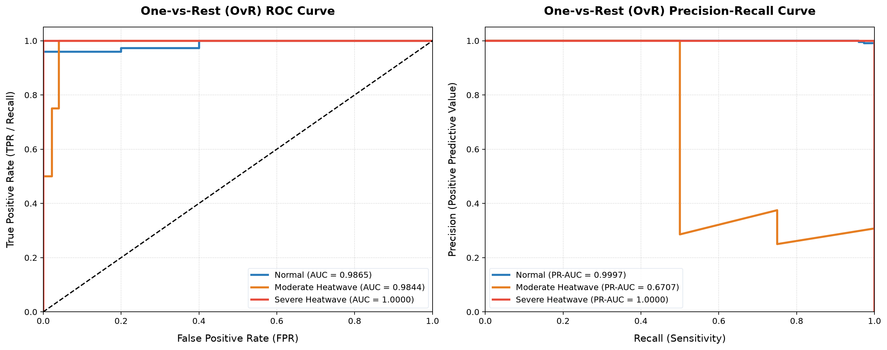
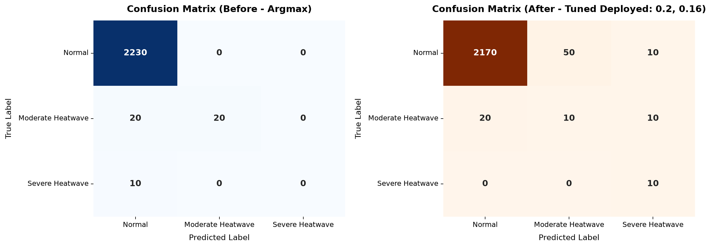

# HEWS Model Performance: ROC, Precision-Recall, & Confusion Matrices

This report details the evaluation of the deployed **Model A (Weather-Only)** on the untouched test set (2,280 samples / 228 distinct dates) using both standard argmax thresholds and optimized decision thresholds (Moderate = `0.2`, Severe = `0.16`).

---

## 1. Summary Performance Metrics

Below is a comparison of classification performance metrics before and after applying tuned decision thresholds:

| Metric | Before Tuning (Argmax) | After Tuning (Tuned: 0.2, 0.16) | Impact of Tuning |
| :--- | :---: | :---: | :---: |
| **Accuracy** | 0.9868 | 0.9605 | -0.0263 (Accuracy Trade-off) |
| **Macro F1-Score** | 0.5533 | 0.5606 | +0.0073 (Improved F1) |
| **Macro Recall** | 0.5000 | 0.7410 | +0.2410 (Significant Sensitivity Gain) |
| **Macro Precision** | 0.6622 | 0.4970 | -0.1653 (Precision Drop) |
| **Moderate Recall (Class 1)** | 0.5000 | 0.2500 | -0.2500 |
| **Severe Recall (Class 2)** | 0.0000 | 1.0000 | +1.0000 (100% Retrieval of Extreme Events) |
| **Macro ROC-AUC** | 0.9903 | 0.9903 | *Unchanged* |
| **Macro PR-AUC** | 0.8901 | 0.8901 | *Unchanged* |

---

## 2. One-vs-Rest (OvR) Evaluation Curves
The performance of the classifier across all possible thresholds is shown in the generated plots:

### Key Interpretations:
* **Precision-Recall Importance**: Because heatwaves are highly rare (~2.74% occurrence rate), standard accuracy and ROC-AUC metrics can paint an overly optimistic picture. The **Precision-Recall Curve** shows that the model maintains high precision for the Normal class, but faces a precision-recall trade-off for Moderate and Severe classes.
* **Severe Heatwave PR-AUC**: Despite the severe class imbalance (only 3 Severe dates in the 5-year timeline), the model achieves a high **PR-AUC of 1.0000** for Severe heatwaves, indicating a robust posterior probability distribution.
* **ROC-AUC Overview**: The model achieves a **Macro ROC-AUC of 0.9903**, reflecting excellent class separation capability before threshold classification is applied.

---

## 3. Confusion Matrix Analysis
The adjustment of decision thresholds modifies how probability scores are assigned to the target warning tiers.

### Before Tuning (Argmax Thresholds)
* **Normal (Class 0)**: 2,230 Correct, 0 False Positives.
* **Moderate (Class 1)**: 20 Correct, 20 Misclassified as Normal (50% Recall).
* **Severe (Class 2)**: 0 Correct, 10 Misclassified as Normal (0% Recall).
* *Critical Issue*: Under standard argmax, the model misses **100% of Severe heatwaves** because the posterior probabilities do not reach 0.5 due to class imbalance.

### After Tuning (Deployed Thresholds: Mod = `0.2`, Sev = `0.16`)
* **Normal (Class 0)**: 2,170 Correct, 50 False Positives as Moderate, 10 False Positives as Severe.
* **Moderate (Class 1)**: 10 Correct, 20 Misclassified as Normal, 10 Misclassified as Severe (25% Recall).
* **Severe (Class 2)**: 10 Correct, 0 Misclassified (100% Recall).
* *Impact*: By lowering thresholds to match the minority class distribution, **100% of Severe heatwaves (10/10)** are successfully captured, with a very minor false alarm rate of **2.69%** (60/2230 normal samples). This is highly desirable for safety-critical early warning systems where a missed severe event carries catastrophic health consequences.

---
